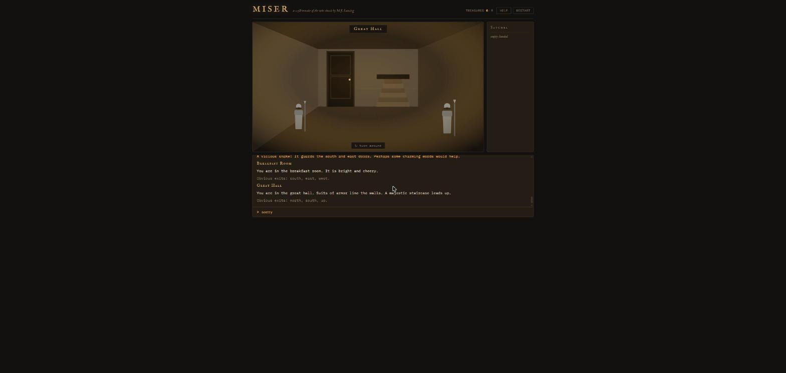

# MISER — a 2.5D Remake

A faithful browser remake of **Miser** by M.J. Lansing (CURSOR magazine #27, © 1981 The Code Works),
the classic treasure-hunt text adventure later reprinted for the Commodore 64 — rebuilt with a
2.5D presentation: every one of the original 46 locations rendered as a candlelit scene you can
click your way through, in your choice of three visual styles.

## Play

**Play it now: <https://robertorenz.github.io/MiserRemake/>**

Or open `index.html` in any modern browser — no build step, no dependencies.

## Three looks, one game

Pick your presentation on the title screen (or switch anytime with the **Look** button in the header —
your choice is remembered):

- **First-Person** — step inside each room in one-point perspective. The view faces the direction
  you walked: the door ahead is the one you just took, and "turn around" rotates you 180° in place.
- **Isometric** — angled bird's-eye view of each room, with your lantern-carrying adventurer
  standing in it.
- **Side View** — cutaway dollhouse-style stage with parallax depth.

All three run on the same engine, data, and minimap — the style is purely how the mansion is drawn.

## Finding your way

- Every door and archway wears its compass letter (**N S E W**, **UP**/**DN** for stairs).
- A **fog-of-war minimap** in the corner reveals only the rooms you have visited, with an arrow
  showing where you are and which way you face, stair chevrons, and automatic switching between
  the ground floor and upstairs. (The hedge maze and the Hall of Mirrors stay disorienting —
  they were non-euclidean in 1981 and remain so, on purpose.)
- Keyboard: in First-Person, **↑** walks forward, **←/→** sidestep, **↓** turns around.
  In Isometric and Side View the arrows are plain compass directions.

## How it plays

- **Click** doors to walk through them and objects to use them — or **type** the original
  two-word commands: `GET`, `MOVE`, `OPEN`, `READ`, `DROP`, `SAY`, `POUR`, `FILL`, `UNLOCK`,
  `TURN`, `JUMP`, `SWIM`, `FIX`, `SCORE`, `I`, and the compass (`N S E W`).
- Five treasures, 20 points each. Treasures cannot be dropped.
- Collect all five and escape the mansion for the top rank: **Grandmaster Adventurer**.

The map, items, puzzles, deaths, magic words, ranks, and nearly all message text are decoded
from the original PET BASIC source — including the one-way front door, the hall-of-mirrors
gag, the misspelled chapel tablet, and `SAY XYZZY`.

## Tech

- Plain HTML/CSS/JS — zero dependencies, one SVG element as the stage.
- `js/scene.js` — first-person renderer (one-point perspective, shared prop library,
  candle-flicker lighting) used by all looks for its vector prop art.
- `js/scene-iso.js` — isometric renderer (diamond floor, upright walls, depth-sorted billboards).
- `js/scene-side.js` — side-view renderer (cutaway stage, parallax bands).
- `js/engine.js` — parser, verbs, dynamic facing, and turn loop mirroring the 1981 engine.
- `js/data.js` — the full game as data: 46 rooms, 16 items, every puzzle handler, minimap
  coordinates.
- `js/main.js` — UI wiring (log, satchel, modals, tooltips, minimap, look switching, keyboard).

Every change is verified by scripting the complete winning walkthrough through the engine in the
browser — 5/5 treasures, 100/100 points, Grandmaster Adventurer — in all three looks.

## Credits

- Original game: **Mary Jean Lansing**, CURSOR #27 (1981), © The Code Works.
- Remake: built with Claude Code. Not affiliated with the original publishers.
